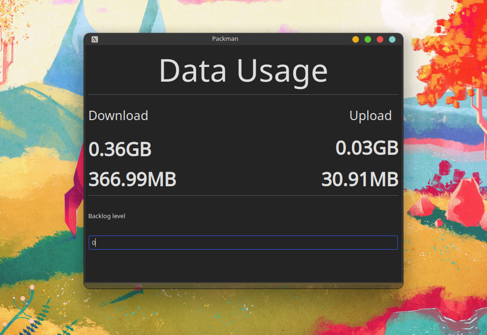

# Packman
The data usage monitoring GUI for linux nobody decided to make until now

## Requirements
`pyqt5`

`psutil` 

You will need pyuic5 installed on your system for    `makegui.py` to work properly, otherwise it has to be done manually.

## Installation (Installations not ready yet) 
`make gui && make build`

## Running without installation (use this instead)
`make gui && make run`

### Installing dependencies with make
>make deps

### Installing dependencies the old fashioned way
>python3 -m pip install -r requirements.txt

# How to use
The backlog level is a field that is subtracted from the GB and MB values
This was added in case the user wanted to keep track of how much data they used beyond a threshold or values that were larger and therefore harder to keep track of.

`makegui.py`: This creates python files in the gui directory of any ui file in the ui directory

Note that this app makes use of the psutil `net_io_counters` method to grab data based on the network interface 

## Milestone
- [ ] Minimize to tray option
- [ ] Graph feature
- [ ] Ability to install
- [ ] Data uploaded view if needed